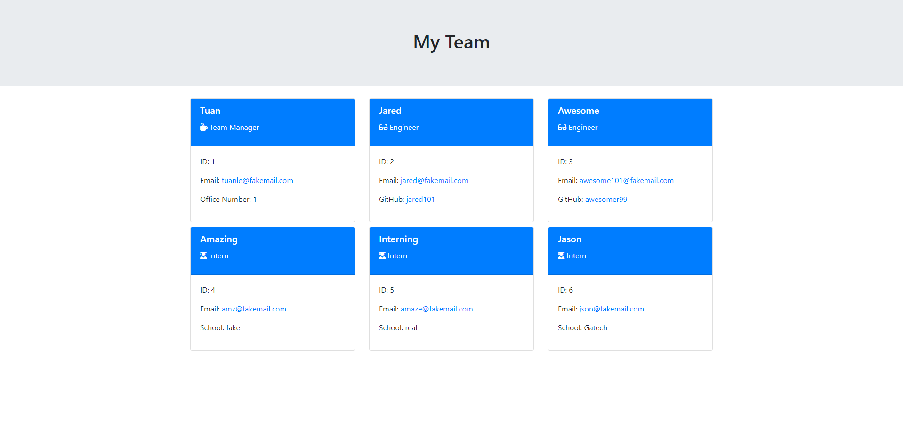

# Team-Profile-Generator

## Description

This project create a list of employee for a team by asking a series of questions.

## Table of Contents

- [Installation](#installation)
- [Instructions](#instructions)

## Installation

npm install inquirer
npm install jest

## Instructions

Execute the project using "node index" in the main directory.

This will prompt the user a series of question about the team manager. At the end of the questionaire, the user have the option to add another engineer or an intern to the team.
